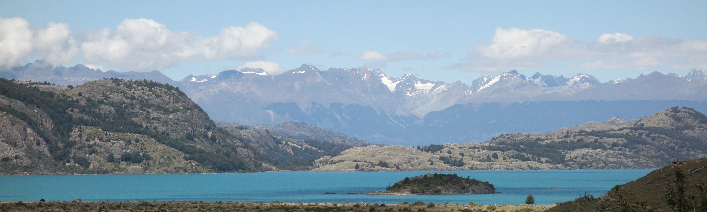

My PhD project is about past and future changes in the **atmospheric water cycle in the Tibetan Plateau-Himalaya region** with a focus on organized convection and extreme precipitation. The Tibetan Plateau stores a lot of freshwater and is, likewise other mountain regions in the world, particularly vulnerable to climate change. My aim is to improve our understanding of the physical processes that lead to extreme precipitation in this particular region, because this is a pre-requisite to robustly assess future changes in the regional climate.

## Mountain meteorology

As I am studying the climate in high mountain regions, I am interested in how complex topography, snow and ice surfaces and other mountain-typical surface features affect the atmosphere by modifying wind circulation, temperature, moisture etc. For this, it is crucial to bridge the gap between observational and modeling perspectives, so I am working with both ground-based and spaceborne observations as well as numerical weather and climate models.

## Interaction between meso-scale and large-scale atmospheric processes 

I am also interested in how large-scale processes such as monsoon-driven atmospheric water vapor transport 
affect meso-scale processes such as the organization of convection. I am particularly interested in the dynamics of mesoscale convective systems (MCSs) - large complexes of thunderstorms- around high mountain regions, because high topographic barriers such as the Rockys, the Andes or the 
Himalayas interact with the atmospheric large-scale flow and create favorable conditions for storm formation 
in the downstream regions. 

## Convection-permitting climate simulations 

To understand how these processes are affected by anthropogenically forced climate change, I am working with 
convection-permitting climate simulations. Our lab is coordinating the [CORDEX Flagship Pilot Study](https://cordex.org/experiment-guidelines/flagship-pilot-studies/) [Convection-Permitting Third Pole](http://rcg.gvc.gu.se/cordex_fps_cptp/) with the goal to systematically  assess
benefits and limitations of convection-permitting simulations in the Tibetan Plateau region. 

## Development of data analysis tools 

Dealing with huge amounts of data from climate models and satellite observations (an even larger number of different
data formats!), I have developed a huge appreciation for open source software tools that facilitate the handling of complex datasets. I am in the developer 
group of a community-developed python package for cloud tracking in large datasets ([**tobac**: Tracking and Object-based Analysis of Clouds](https://github.com/tobac-project/tobac)) and I am motivated to become more active in the open source community! 
