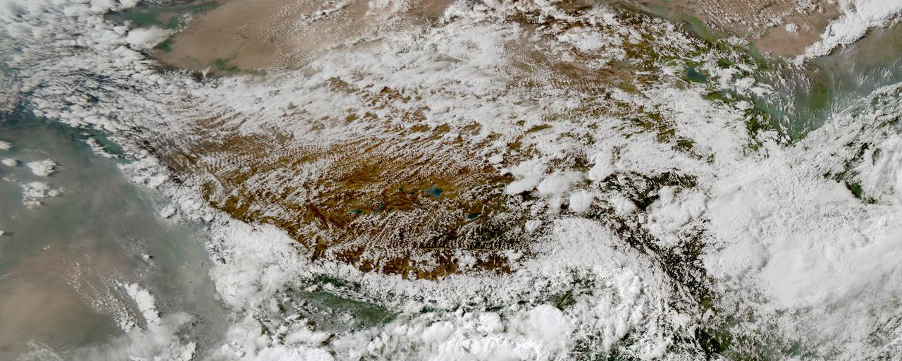
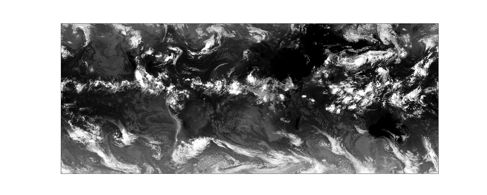

My long-term scientific goal is to **understand, model, and predict convective storms** and how their impact on precipitation and other water cycle components changes as a response to global warming. 

## Ph.D. thesis: Storms in mountain regions 

In my [Ph.D. thesis](https://gupea.ub.gu.se/handle/2077/75117?show=full), I have studied the role of large-scale and mesoscale atmospheric processes in the **water cycle in the Tibetan Plateau-Himalaya region** with a focus on organized convection and precipitation. The Tibetan Plateau stores a lot of freshwater and is, likewise other mountain regions in the world, particularly vulnerable to climate change. Changes in the water cycle come with changes in the frequency and magnitude of precipitation and increased risks for natural hazards in the populated downstream regions. The goal of my Ph.D. work was to improve our understanding of atmospheric processes that control precipitation in this particular region, because this is a pre-requisite to robustly assess future changes in precipitation. Apart from the societal need of regional climate change impact assessment, my thesis addressed a major scientific knowledge gap because we know very little about precipitation in mountain regions. By combining in-situ and satellite observations with numerical models, I showed that organized convective storm systems contribute significantly to seasonal and extreme precipitation in the Tibetan Plateau region, but that our models still struggle to get the right characteristics of these storms. 

## Storms in km-scale climate model simulations 

To understand the role of convective storms in our climate system, I am working with kilometer-scale (km) models that are partly able to resolve **convective processes and storm dynamics**. These numerical model simulations are run at a high spatial resolution (1-10km horizontal grid spacing) and have the potential to better represent mesoscale processes and small-scale features that are not resolved by conventional regional and global climate models. I am involved in the [CORDEX Flagship Pilot Study](https://cordex.org/experiment-guidelines/flagship-pilot-studies/) [Convection-Permitting Third Pole](http://rcg.gvc.gu.se/cordex_fps_cptp/) and the [South America Affinity Group](https://ral.ucar.edu/projects/south-america-affinity-group-saag) where we assess benefits and limitations of km-scale simulations in particular regions. For my postdoctoral research at NCAR, I aim to better **leverage satellite observations and come up with new methods to evaluate how well current km-scale models** capture different types of convective storms and their impact on precipitation. 

## Microscale, mesoscale and large-scale atmospheric processes affecting convective precipitation

A major goal of my research is to disentangle what happens on different temporal and spatial scales. This is because I am interested in the broader question of how global warming and all the climatic changes that come with it affect our day-to-day weather patterns. I am, for example, interested in how large-scale processes like monsoon-driven atmospheric water vapor transport affect the occurrence and intensity of convective storms. I am particularly interested in the physical processes that influence **mesoscale convective systems (MCSs)** - large complexes of deep convective storms that produce large amounts of precipitation. I am currently investigating the how well we simulate the **precipitation efficiency of MCSs** at different spatial resolutions and what the potential climate change effects on this are since precipitation efficiency is another factor that could be important for future changes in precipitation. 

## Cloud tracking in big datasets 

Dealing with huge amounts of data from climate models and satellite observations (and an even larger number of different
data formats!), I have developed a huge appreciation for open source software tools that facilitate the handling of complex datasets. I am part of the developer group of a **community-developed python package for cloud tracking** in large atmospheric datasets ([**tobac**: Tracking and Object-based Analysis of Clouds](https://github.com/tobac-project/tobac)). The identification and tracking of convective storms is crucial for a process-oriented evaluation of km-scale climate models, because it allows us to follow the lifecycle of the simulated storms. This helps advancing our understanding of how well we capture certain aspects of convective storms and how this in turn affects other components in the modelled climate system. 

