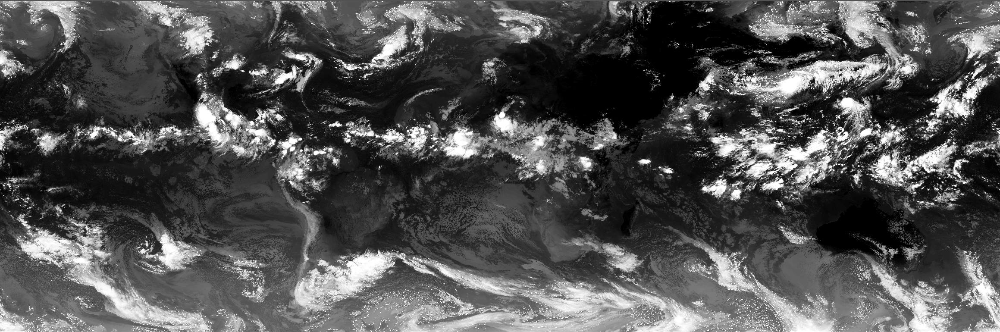

My research aims to **model, quantify and predict the effects of climate change on regional-to-global precipitation dynamics**. I want to understand how warming modifies the intensity, frequency, and spatial distribution of precipitation and their cascading impacts on other components in the hydrological cycle. To achieve this, I integrate **kilometer-scale climate modeling** (e.g., MPAS, WRF) with **multi-platform satellite observations** (e.g., GPM, CloudSat) and advanced diagnostic tools, enabling a process-oriented understanding of precipitation shifts under anthropogenic forcing.

## Precipitation processes: from microscale to large-scale

A key question in my research is to disentangle what happens on different temporal and spatial scales to understand how global warming and all the climatic changes that come with it affect our day-to-day weather patterns. I am currently studying the **precipitation efficiency of different storms systems** and [simulated at different spatial resolutions](https://agupubs.onlinelibrary.wiley.com/doi/10.1029/2024JD041924?af=R)** because I want to understand if changes in precipitation efficiency could be another important factors that influence future changes in precipitation patterns. 

I am also interested in how large-scale processes like [monsoon-driven atmospheric water vapor transport](https://link.springer.com/article/10.1007/s00382-024-07324-w) affect the occurrence and intensity of convective storms. A specific focus of my research are **mesoscale convective systems (MCSs)** - large complexes of deep convective storms - because such storms produce large amounts of the seasonal precipitation in the tropics and mid-latitudes, and also often cause extreme events such as flash flooding. 

## Convective storms in km-scale climate model simulations 

To understand the role of convective storms in our climate system, I am working with kilometer-scale (km) models that are partly able to resolve **convective processes and storm dynamics**. These numerical model simulations are run at a high spatial resolution (~2-9 km horizontal grid spacing) and have the potential to better represent mesoscale processes and small-scale features that are not resolved by conventional regional and global climate models. Such features include, for instance, turbulent moisture transport, land-atmosphere interactions and convective organization. I am involved in multiple international efforts where we assess benefits and limitations of km-scale simulations in particular regions: [CORDEX Flagship Pilot Study](https://cordex.org/experiment-guidelines/flagship-pilot-studies/) [Convection-Permitting Third Pole](http://rcg.gvc.gu.se/cordex_fps_cptp/), [South America Affinity Group](https://ral.ucar.edu/projects/south-america-affinity-group-saag), and [NCAR's Water system program](https://ral.ucar.edu/hap/water-systems-program) which has created a long-term high-resolution climate model dataset over the US ([CONUS404](https://rda.ucar.edu/datasets/d559000/)). For my postdoctoral research at NCAR, I aim to better **leverage satellite observations and develop new methods to evaluate how well current km-scale models** capture different aspects of convective storms and their impact on precipitation. 

## Cloud tracking in big datasets

Dealing with huge amounts of data from climate models and satellite observations (and an even larger number of different
data formats!), I have developed a huge appreciation for open source software tools that facilitate the handling of complex datasets. I am part of the developer group of a **community-developed python package for cloud tracking** in large atmospheric datasets ([**tobac**: Tracking and Object-based Analysis of Clouds](https://github.com/tobac-project/tobac)). The identification and tracking of convective storms is crucial for a process-oriented evaluation of km-scale climate models, because it allows us to follow the lifecycle of the simulated storms. This helps advancing our understanding of how well we capture certain aspects of convective storms and how this in turn affects other components in the modelled climate system:

* [MCS tracking in satellite observations over East Asia](https://agupubs.onlinelibrary.wiley.com/doi/full/10.1029/2021JD035279#:~:text=Mesoscale%20convective%20systems%20(MCSs)%20have,well%20understood%20in%20this%20location.)
* [MCS tracking in km-scale model simulations over the Tibetan Plateau](https://journals.ametsoc.org/view/journals/clim/36/17/JCLI-D-22-0240.1.xml)
* [MCS tracking intercomparison in global km-scale models](https://essopenarchive.org/users/532574/articles/1215683-mesoscale-convective-systems-tracking-method-intercomparison-mcsmip-application-to-dyamond-global-km-scale-simulations)
* [MCS tracking intercomparison in km-scale model simulations over South America](https://agupubs.onlinelibrary.wiley.com/doi/10.1029/2023JD040254)

## Ph.D. thesis: Understanding precipitation processes in mountain regions 

In my [Ph.D. thesis](https://gupea.ub.gu.se/handle/2077/75117?show=full), I have studied the role of large-scale and mesoscale atmospheric processes in the **water cycle in the Tibetan Plateau-Himalaya region** with a focus on organized convection and precipitation. The Tibetan Plateau stores a lot of freshwater and is, likewise other mountain regions in the world, particularly vulnerable to climate change. Changes in the water cycle come with changes in the frequency and magnitude of precipitation and increased risks for natural hazards in the populated downstream regions. The goal of my Ph.D. work was to improve our understanding of atmospheric processes that control precipitation in this particular region, because this is a pre-requisite to robustly assess future changes in precipitation. Apart from the societal need of regional climate change impact assessment, my thesis addressed a major scientific knowledge gap because we know very little about precipitation in mountain regions. By combining in-situ and satellite observations with numerical models, I showed that organized convective storm systems contribute significantly to seasonal and extreme precipitation in the Tibetan Plateau region, but that our models still struggle to get the right characteristics of these storms.

