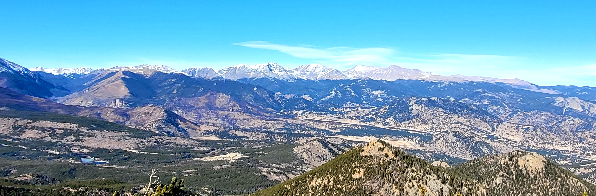

My long-term scientific goal is to **understand, model, and predict convective storms** and their impact on precipitation other water cycle components. 

## Ph.D. thesis

In my [Ph.D. thesis](https://gupea.ub.gu.se/handle/2077/75117?show=full), I have studied the role of large-scale and mesoscale atmospheric processes in the **water cycle in the Tibetan Plateau-Himalaya region** with a focus on organized convection and precipitation. The Tibetan Plateau stores a lot of freshwater and is, likewise other mountain regions in the world, particularly vulnerable to climate change. Changes in the water cycle come with changes in the frequency and magnitude of precipitation and increased risks for natural hazards in the populated downstream regions. The goal of my research is to improve our understanding of atmospheric processes that control precipitation in this particular region, because this is a pre-requisite to robustly assess future changes. Apart from the societal need of regional climate change impact assessment, this thesis addresses a major scientific knowledge gap, as we know very little about precipitation in mountain regions. 

## Mountain meteorology

As I am studying the climate in high mountain regions, I am interested in how complex topography, snow and ice surfaces and other mountain-typical features affect the atmosphere by modifying wind circulation, temperature, moisture etc. For this, it is crucial to bridge the gap between observational and modeling perspectives, so I am working with both ground-based and spaceborne observations as well as numerical weather and climate models. 

## Interaction between mesoscale and large-scale atmospheric processes 

One objective in my research is to disentangle what happens on different spatial scales. I am thus interested in how large-scale processes (e.g. monsoon-driven atmospheric water vapor transport) affect mesoscale processes (e.g. the organization of convective storms). I am particularly interested in the role of mesoscale convective systems (MCSs) - large complexes of thunderstorms that often occur around high mountain regions, because high topographic barriers such as the Rockies, the Andes or the Himalayas interact with the atmosphere in a way that creates favorable conditions for storm formation in the downstream regions. 

## Convection-permitting climate simulations 

To understand how such processes are affected by anthropogenically forced climate change, I am working with
convection-permitting (aka kilometer-scale) climate simulations. These numerical model simulations are run at a high spatial resolution (2-9km)
and have the potential to better represent mesoscale processes and small-scale features that are not resolved by conventional regional climate models. 
Our lab is coordinating the [CORDEX Flagship Pilot Study](https://cordex.org/experiment-guidelines/flagship-pilot-studies/) [Convection-Permitting Third Pole](http://rcg.gvc.gu.se/cordex_fps_cptp/) with the goal to systematically assess benefits and limitations of convection-permitting simulations in the Tibetan Plateau region. In my future research, I want to better leverage satellite observations to understand how well current convection-permitting models capture different types of convective storms. 

## Development of data analysis tools 

Dealing with huge amounts of data from climate models and satellite observations (and an even larger number of different
data formats!), I have developed a huge appreciation for open source software tools that facilitate the handling of complex datasets. I am part of the developer group of a community-developed python package for cloud tracking in large atmospheric datasets ([**tobac**: Tracking and Object-based Analysis of Clouds](https://github.com/tobac-project/tobac)) and I am motivated to become more active in the open source community! 
